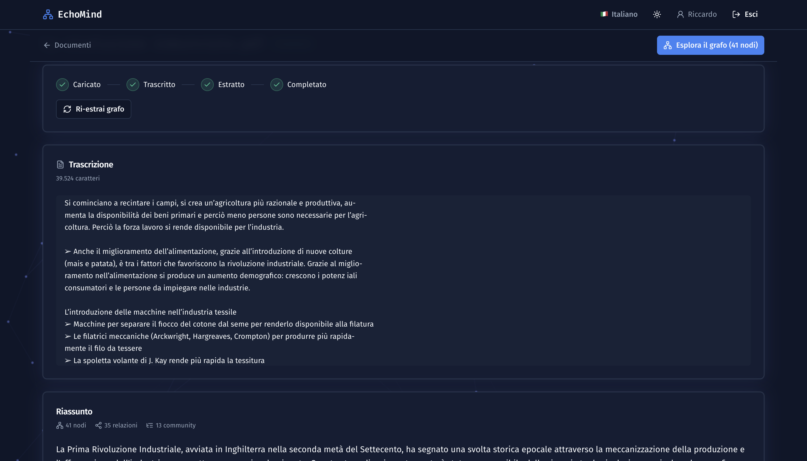
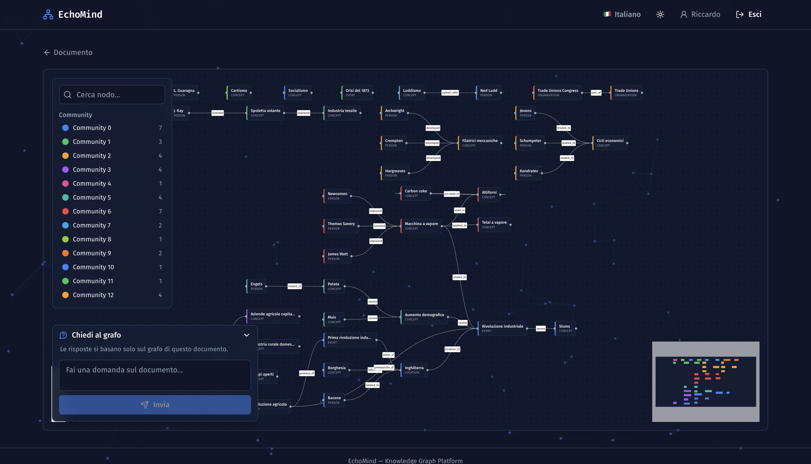
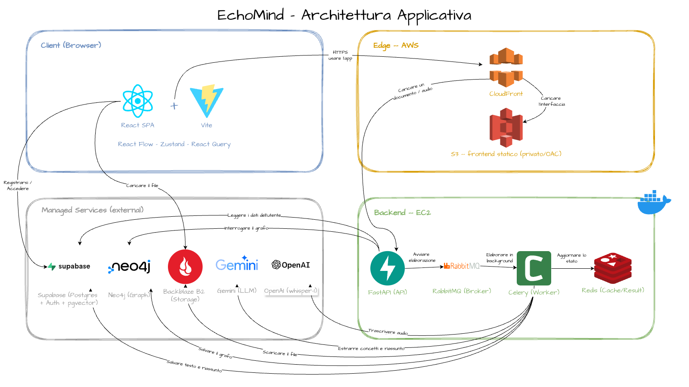
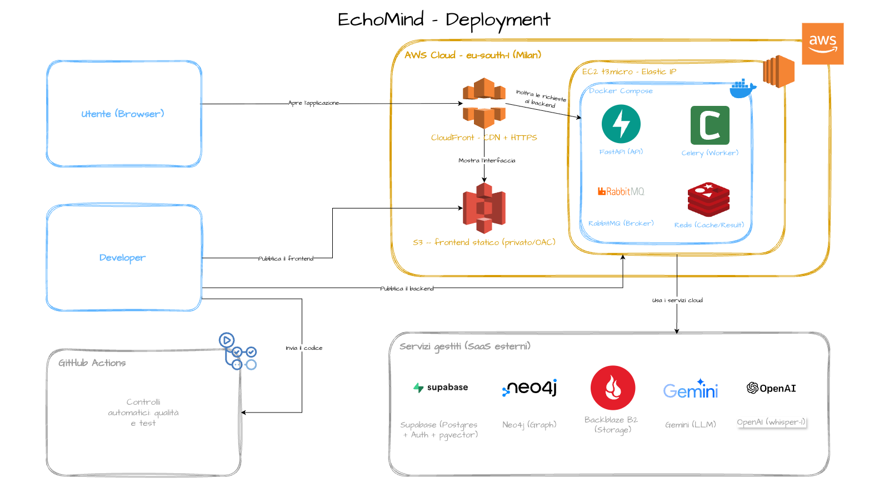

<div align="center">

# 🧠 EchoMind

**AI-powered GraphRAG: turn documents and audio into interactive knowledge graphs and multi-level summaries.**
**GraphRAG potenziato dall'AI: trasforma documenti e audio in grafi di conoscenza interattivi e riassunti multi-livello.**

🌐 **Live demo:** https://d1r88wq8sndssf.cloudfront.net

[](https://github.com/riccardocatervi/EchoMind/actions/workflows/ci.yml)
[](LICENSE)
[](https://d1r88wq8sndssf.cloudfront.net)
[](#tech-stack)
[](#tech-stack)

[English](#-english) · [Italiano](#-italiano) · [Architecture](#architecture--architettura) · [Acknowledgments](#-acknowledgments--riconoscimenti)

</div>

> ℹ️ The live instance runs on a stoppable EC2 instance to stay within the AWS Free Tier. If the API looks offline, it is being woken up for a demo — the static frontend always loads, the backend takes ~1–2 minutes after start.
> L'istanza live gira su una EC2 spegnibile per restare nel Free Tier AWS. Se l'API sembra offline, è in fase di accensione per una demo — il frontend statico carica sempre, il backend è pronto ~1–2 minuti dopo lo start.

---

## 📸 Screenshots / Anteprima

| Multi-level summary · Riassunto multi-livello | Interactive knowledge graph · Grafo interattivo |
|:---:|:---:|
|  |  |

---

# 🇬🇧 English

## What is EchoMind?

EchoMind ingests **text documents or audio recordings**, automatically extracts the key **concepts and their relationships**, builds a **navigable knowledge graph**, produces a **multi-level summary**, and lets the user **ask questions in natural language** (GraphRAG). Raw information becomes visual, explorable knowledge.

Typical flow:

1. The user uploads a document/audio file (direct browser → object storage upload via presigned URL).
2. An async worker **transcribes** audio to text (OpenAI Whisper) when needed.
3. Another async worker **extracts** entities + relationships with an LLM (Google Gemini), persists the graph on Neo4j, computes a recursive summary and entity **embeddings** (pgvector).
4. The frontend renders the interactive graph (React Flow + ELK layout) and answers natural-language questions via **GraphRAG** (vector retrieval on pgvector + graph context from Neo4j + LLM answer).

### Key features

- 📄 **Document & 🎙️ audio ingestion** with direct-to-storage uploads (presigned URLs).
- 🧠 **Automatic knowledge-graph extraction** (entities, relationships, communities) via LLM.
- 🗺️ **Interactive graph visualization** with progressive layout (React Flow + ELK).
- 📝 **Multi-level recursive summaries**.
- 💬 **Natural-language Q&A (GraphRAG)** grounded on your own documents.
- 🔐 **Per-user data isolation** enforced by database Row-Level Security.
- 🌍 **Multilingual UI** (i18n) with output-language preference.

## Live demo & test credentials

- **URL:** https://d1r88wq8sndssf.cloudfront.net
- Self-registration is **disabled** on the live instance to prevent spam sign-ups.
- Use the **test credentials**, provided **on request by email** (kept out of the public repo on purpose, per good practice). When running locally against your own Supabase project, you can re-enable sign-ups and register freely.

## Architecture — Architettura

EchoMind is **not** a microservices system. It is a **modular monolith API + asynchronous workers**, with **polyglot persistence** and several managed cloud services (12-factor style: every backing service is an attached resource configured via environment variables).

```
            ┌──────────────────────────────────────────────────────────────┐
 Browser ──▶│  CloudFront (HTTPS, single distribution)                      │
 (HTTPS)    │   ├── default behavior ───▶ S3 (private, OAC)  =  React SPA    │
            │   └── /api/* behavior  ───▶ EC2 origin (HTTP, port 8000)       │
            └───────────────────────────────────┬──────────────────────────┘
                                                 │
                         EC2 (Docker Compose)    ▼
            ┌──────────────────────────────────────────────────────────────┐
            │  api      → FastAPI (uvicorn)   — REST API, auth, RAG          │
            │  worker   → Celery              — transcribe / extract tasks   │
            │  rabbitmq → broker (job queue)                                 │
            │  redis    → Celery result backend + cache                      │
            └───────────────┬──────────────────────────────────────────────┘
                            │  outbound network
                            ▼
   Supabase (Postgres + Auth/JWT + RLS, pgvector) · Neo4j AuraDB (graph)
   Backblaze B2 (S3-compatible object storage) · Google Gemini · OpenAI Whisper
```

> 📌 **Diagrams:** detailed **architecture** and **deployment** diagrams (draw.io) live in [`docs/diagrams/`](docs/diagrams/) and are embedded below. See [Creating the diagrams](#creating-the-diagrams-drawio) if they are missing.
>
> 
> 

### Why these choices (design rationale)

| Decision | Why |
|---|---|
| **Modular monolith API + Celery workers** | Heavy work (transcription, LLM extraction) must not block HTTP requests. The API stays responsive; workers process long jobs asynchronously with retries and dead-letter handling. |
| **Polyglot persistence** | Relational data (users, documents, tasks, summaries, embeddings) → Postgres/Supabase; the knowledge graph (nodes/edges/communities) → Neo4j (native graph queries in Cypher). The right database for each shape of data. |
| **Supabase (BaaS) for Auth + Postgres** | Managed JWT auth + Row-Level Security so every user only ever sees their own rows, enforced at the database level. |
| **Presigned-URL direct upload (Backblaze B2)** | The browser uploads files straight to object storage, bypassing backend bandwidth. |
| **pgvector + Neo4j for GraphRAG** | Vector similarity (pgvector `<=>`) finds seed entities; the graph supplies relational context; the LLM produces a grounded answer. |
| **Single CloudFront distribution (SPA + API)** | Same origin for UI and API → no CORS, no mixed content, free managed HTTPS, no custom domain required. |
| **Environment-variable configuration (12-factor)** | No secrets in code. Every credential/URL comes from the environment; `.env.example` documents them. |

### Why not microservices?

EchoMind deliberately favours a **modular monolith + an asynchronous worker tier** over microservices. The domain is cohesive (one pipeline: document → graph → Q&A) and the project is single-developer, so microservices would add real costs — operational complexity (service discovery, gateway, distributed observability), distributed-transaction/consistency headaches, and harder local development — **without tangible benefits at this scale**. The chosen design still captures the main advantage that matters here (heavy work offloaded to independently runnable/scalable workers via a message broker) while keeping the system simple, debuggable and cheap to run. Microservices would become the right call with larger teams, independent domains, or much higher scale.

## Tech stack

**Frontend:** React 18 + Vite + TypeScript, Tailwind CSS, React Flow (`@xyflow/react`) + `elkjs` layout, Zustand, TanStack Query, `@supabase/supabase-js`, GSAP (animated Yeti login), i18next.

**Backend:** Python 3.12, FastAPI, Celery, SQLAlchemy 2 (async, asyncpg), Alembic, `python-jose` (JWT ES256/HS256), `structlog`, boto3 (S3-compatible), `google-genai` (Gemini), OpenAI SDK (Whisper), `neo4j`, `pgvector`, `networkx` (Louvain communities).

**Data & infra:** Supabase (PostgreSQL + Auth + RLS + pgvector), Neo4j AuraDB, Backblaze B2, RabbitMQ, Redis.

**DevOps:** Docker + Docker Compose, GitHub Actions CI, AWS (EC2, S3, CloudFront), `uv` (Python), `pnpm` (Node).

## Repository structure

```
EchoMind/
├── backend/                      # FastAPI + Celery (Python, src-layout, uv)
│   ├── Dockerfile                # production image (API + worker share it)
│   ├── src/echomind/             # api/ · worker/ · extraction/ · rag/ · services/ · db/ · core/
│   ├── alembic/                  # database migrations
│   ├── tests/                    # pytest (unit + integration with real Postgres)
│   └── pyproject.toml · uv.lock
├── frontend/                     # React SPA (Vite + TS, feature-based)
│   ├── src/                      # app/ · shared/ · features/ (auth, documents, graph, ...)
│   └── package.json · pnpm-lock.yaml
├── infra/
│   ├── docker-compose.dev.yml    # LOCAL infra: Postgres+pgvector, Neo4j, RabbitMQ, Redis
│   ├── docker-compose.prod.yml   # PRODUCTION stack: api + worker + rabbitmq + redis
│   ├── postgres-init/            # dev role bootstrap (app_runtime for RLS)
│   └── supabase-prod-setup.sql   # one-time Supabase setup (RLS role, pgvector grants)
├── docs/
│   ├── adr/                      # Architectural Decision Records (0001–0009)
│   └── diagrams/                 # architecture.png · deployment.png (draw.io exports)
├── scripts/                      # env check, secret scanners
├── .github/workflows/ci.yml      # CI pipeline (backend, frontend, secrets)
├── .env.example                  # backend env template (committed)
├── frontend/.env.example         # frontend env template (committed)
└── Makefile                      # developer interface
```

## Prerequisites

**All platforms**
- [Docker Desktop](https://www.docker.com/products/docker-desktop/) with Compose v2 (the only hard requirement to run the stack).
- [Git](https://git-scm.com/).

**For local development of individual parts (optional)**
- Backend: Python ≥ 3.12 and [`uv`](https://docs.astral.sh/uv/) ≥ 0.4.
- Frontend: Node ≥ 22 and [`pnpm`](https://pnpm.io/) 11. `ffmpeg` and `libmagic` are needed only when running the worker outside Docker (the Docker image already bundles them).

**Windows-specific notes**
- Enable the **WSL2 backend** in Docker Desktop (Settings → General → *Use WSL 2 based engine*).
- Run the commands below from **PowerShell** or a **WSL2 (Ubuntu)** shell. `make` is not available on stock Windows — either use WSL2 (recommended) or run the equivalent `docker compose` commands shown next to each `make` target.
- Use `git config --global core.autocrlf input` before cloning to avoid CRLF issues in shell scripts.

**macOS-specific notes**
- Install Docker Desktop (Apple Silicon or Intel). `make` ships with the Xcode Command Line Tools (`xcode-select --install`).

## Configuration (environment variables)

EchoMind follows the 12-factor principle: **no secrets in code**. All configuration is provided via environment variables, documented in two templates:

- [`.env.example`](.env.example) — backend (database, Supabase, Neo4j, Backblaze B2, Gemini, OpenAI, broker/cache, tuning).
- [`frontend/.env.example`](frontend/.env.example) — frontend (`VITE_API_BASE_URL`, `VITE_SUPABASE_URL`, `VITE_SUPABASE_ANON_KEY`).

Create your real files (these are git-ignored — never committed):

```bash
cp .env.example .env.production          # backend (used by docker-compose.prod.yml)
cp frontend/.env.example frontend/.env   # frontend (used by Vite)
```

The free-tier managed services you need accounts for (all have free plans; documented per the “BaaS is allowed if documented” rule):

| Service | Used for | Where to get the values |
|---|---|---|
| **Supabase** | Postgres + Auth (JWT) + RLS + pgvector | Project Settings → API (URL, anon key, service_role); JWT Keys (ES256 public key) |
| **Neo4j AuraDB** | Knowledge graph | Instance credentials file (`neo4j+s://…` URI, user, password) |
| **Backblaze B2** | Object storage (S3-compatible) | Application key (keyID + applicationKey), bucket name, S3 endpoint, region |
| **Google Gemini** | Entity/relation extraction, summaries, embeddings | Google AI Studio API key |
| **OpenAI** | Audio transcription (Whisper) | OpenAI API key |

> **Database URL tip (Supabase):** use the **Session pooler** connection string (port `5432`, IPv4, supports prepared statements) and change the scheme to `postgresql+asyncpg://…`.

## Run it — Option A: production-like, with Docker Compose (recommended)

This runs the API + worker + RabbitMQ + Redis as containers (no development server), exactly as in production. It connects to the managed services configured in `.env.production`.

```bash
git clone https://github.com/riccardocatervi/EchoMind.git
cd EchoMind
cp .env.example .env.production          # then fill in the real values (see table above)

# 1) Apply the database schema to Supabase (one-off, idempotent)
docker compose -f infra/docker-compose.prod.yml run --rm --no-deps api alembic upgrade head

# 2) One-time Supabase setup (RLS runtime role + pgvector grants) — run the SQL in
#    infra/supabase-prod-setup.sql from the Supabase SQL Editor.

# 3) Start the whole backend stack
docker compose -f infra/docker-compose.prod.yml up -d --build

# 4) Check it is healthy
curl http://localhost:8000/api/v1/health      # -> {"status":"ok",...}
```

Frontend (static build, served by any static host — in production it is S3+CloudFront):

```bash
cd frontend
cp .env.example .env                          # set VITE_API_BASE_URL=http://localhost:8000, Supabase URL + anon key
pnpm install
pnpm build                                    # output in frontend/dist/
pnpm preview                                  # serves dist/ locally for a production-like preview
```

> 🟢 **Don’t want to set anything up?** Just open the **live demo**: https://d1r88wq8sndssf.cloudfront.net

## Run it — Option B: local development

For development you can run the local infrastructure in Docker and the app with hot-reload. On macOS/Linux the `Makefile` wraps the commands; on Windows use the `docker compose` / `uv` / `pnpm` equivalents shown.

```bash
# Backend
make install            # uv sync --all-groups           (or: cd backend && uv sync --all-groups)
make dev                # docker compose -f infra/docker-compose.dev.yml up -d   (Postgres, Neo4j, RabbitMQ, Redis)
make migrate            # cd backend && uv run alembic upgrade head
make serve              # cd backend && uv run uvicorn echomind.main:create_app --factory --reload --port 8000
make worker             # cd backend && uv run celery -A echomind.worker.celery_app:celery_app worker -Q echomind.default

# Frontend (separate terminal)
cd frontend && pnpm install && pnpm dev       # Vite dev server on http://localhost:5173
```

> Development servers (`uvicorn --reload`, `vite`) are for local iteration only; the **deployment** uses containers (Option A / AWS), never `--reload`.

## Tests

```bash
# Backend (pytest; integration tests use a real Postgres)
make test                       # or: cd backend && uv run pytest
make test-cov                   # with coverage report

# Frontend (vitest)
cd frontend && pnpm test

# Full quality gate locally (what CI runs)
make verify                     # ruff lint + format check + mypy + pytest
```

**What is tested:** backend schema/repository/service logic, Celery task cores against a real database, API end-to-end flows, and Row-Level Security enforcement. The frontend uses Vitest + Testing Library for components/hooks.

## CI/CD pipeline

GitHub Actions ([`.github/workflows/ci.yml`](.github/workflows/ci.yml)) runs on every push and pull request, with three independent jobs:

1. **`backend-verify`** — spins up a real `pgvector/pgvector:pg16` service, installs deps with `uv`, applies the dev-role init script + Alembic migrations, then runs **ruff** (lint), **ruff format --check**, **mypy --strict**, and **pytest** with coverage.
2. **`frontend-verify`** — installs with `pnpm`, then **eslint**, **prettier --check**, **tsc** (typecheck), **vitest**, and a production **build**.
3. **`secrets-scan`** — **gitleaks** over the full history plus a custom script that blocks real credentials accidentally pasted into test/CI files.

Locally, the same checks are wired as **pre-commit hooks** (`make precommit-install`) so issues are caught before pushing.

## Deployment

Production runs on **AWS Free Tier**:

- **Backend** on a single **EC2 `t3.micro`** (Ubuntu) running the production Docker Compose stack (api + worker + RabbitMQ + Redis), behind a stable **Elastic IP**. A 2 GB swap file keeps the 1 GB instance comfortable.
- **Frontend** as a **static build on a private S3 bucket**, served via **CloudFront** (managed HTTPS).
- A **single CloudFront distribution** serves the SPA by default and routes `/api/*` to the EC2 origin → same origin for UI and API (no CORS, no mixed content).
- The stateful data lives in managed services (Supabase, Neo4j AuraDB, Backblaze B2), so the EC2 instance is disposable and can be stopped/started freely.

**Stop / start the backend** (the public URL stays the same thanks to the Elastic IP):

```bash
aws ec2 stop-instances  --instance-ids <INSTANCE_ID>     # park it (save Free-Tier hours)
aws ec2 start-instances --instance-ids <INSTANCE_ID>     # before a demo; ready in ~1–2 min
```

See [`infra/supabase-prod-setup.sql`](infra/supabase-prod-setup.sql) for the one-time Supabase setup required by the deployment, and [`docs/adr/`](docs/adr/) for the architectural decisions taken along the way.

## Troubleshooting

- **`curl /api/v1/health` fails on the live URL** → the EC2 instance is stopped; start it and wait ~1–2 minutes.
- **`docker compose up` fails: env file not found** → create `.env.production` from `.env.example` first.
- **Windows: `make: command not found`** → use WSL2, or run the `docker compose` / `uv` / `pnpm` commands shown next to each target.
- **Supabase + asyncpg errors about prepared statements / IPv6** → use the **Session pooler** URL (port 5432) with the `postgresql+asyncpg://` scheme.

---

# 🇮🇹 Italiano

## Cos'è EchoMind?

EchoMind ingerisce **documenti testuali o registrazioni audio**, ne estrae automaticamente i **concetti chiave e le loro relazioni**, costruisce un **grafo di conoscenza navigabile**, produce un **riassunto multi-livello** e permette di **porre domande in linguaggio naturale** (GraphRAG). L'informazione grezza diventa conoscenza visuale ed esplorabile.

Flusso tipico:

1. L'utente carica un documento/audio (upload diretto dal browser → object storage tramite presigned URL).
2. Un worker asincrono **trascrive** l'audio in testo (OpenAI Whisper) quando serve.
3. Un altro worker asincrono **estrae** entità e relazioni con un LLM (Google Gemini), persiste il grafo su Neo4j, calcola un riassunto ricorsivo e gli **embedding** delle entità (pgvector).
4. Il frontend mostra il grafo interattivo (React Flow + layout ELK) e risponde alle domande in linguaggio naturale via **GraphRAG** (retrieval vettoriale su pgvector + contesto dal grafo Neo4j + risposta dell'LLM).

### Funzionalità principali

- 📄 **Ingestione di documenti** e 🎙️ **audio** con upload diretto allo storage (presigned URL).
- 🧠 **Estrazione automatica del grafo di conoscenza** (entità, relazioni, community) via LLM.
- 🗺️ **Visualizzazione interattiva del grafo** con layout progressivo (React Flow + ELK).
- 📝 **Riassunti ricorsivi multi-livello**.
- 💬 **Q&A in linguaggio naturale (GraphRAG)** fondato sui tuoi documenti.
- 🔐 **Isolamento dei dati per utente** garantito dalla Row-Level Security del database.
- 🌍 **UI multilingua** (i18n) con preferenza sulla lingua di output.

## Demo live e credenziali di prova

- **URL:** https://d1r88wq8sndssf.cloudfront.net
- La registrazione autonoma è **disabilitata** sull'istanza live per evitare iscrizioni spam.
- Usa le **credenziali di prova**, fornite **su richiesta via email** (tenute fuori dal repo pubblico per buona pratica). Eseguendo in locale sul tuo progetto Supabase, puoi riabilitare le iscrizioni e registrarti liberamente.

## Architettura

EchoMind **non** è un sistema a microservizi. È un **monolite modulare (API) + worker asincroni**, con **persistenza poliglotta** e diversi servizi cloud gestiti (stile 12-factor: ogni backing service è una risorsa esterna configurata tramite variabili d'ambiente). Lo schema e i diagrammi sono nella sezione [Architecture](#architecture--architettura) sopra e in [`docs/diagrams/`](docs/diagrams/).

### Perché queste scelte (motivazioni)

| Scelta | Motivazione |
|---|---|
| **Monolite modulare + worker Celery** | Il lavoro pesante (trascrizione, estrazione LLM) non deve bloccare le richieste HTTP. L'API resta reattiva; i worker elaborano i job lunghi in modo asincrono con retry e dead-letter. |
| **Persistenza poliglotta** | Dati relazionali (utenti, documenti, task, riassunti, embedding) → Postgres/Supabase; il grafo di conoscenza (nodi/archi/community) → Neo4j (query native in Cypher). Il database giusto per ogni forma di dato. |
| **Supabase (BaaS) per Auth + Postgres** | Auth JWT gestita + Row-Level Security: ogni utente vede solo le proprie righe, garantito a livello di database. |
| **Upload diretto via presigned URL (Backblaze B2)** | Il browser carica i file direttamente sull'object storage, senza consumare banda del backend. |
| **pgvector + Neo4j per il GraphRAG** | La similarità vettoriale (pgvector `<=>`) trova le entità seme; il grafo fornisce il contesto relazionale; l'LLM produce una risposta fondata sui dati. |
| **Singola distribuzione CloudFront (SPA + API)** | Stessa origine per UI e API → niente CORS, niente mixed content, HTTPS gestito gratuito, nessun dominio richiesto. |
| **Configurazione via variabili d'ambiente (12-factor)** | Nessun segreto nel codice. Ogni credenziale/URL viene dall'ambiente; `.env.example` le documenta. |

### Perché non microservizi?

EchoMind sceglie consapevolmente un **monolite modulare + un tier di worker asincroni** invece dei microservizi. Il dominio è coeso (un'unica pipeline: documento → grafo → Q&A) e il progetto è single-developer, quindi i microservizi aggiungerebbero costi reali — complessità operativa (service discovery, gateway, osservabilità distribuita), problemi di transazioni/consistenza distribuita e sviluppo locale più difficile — **senza benefici concreti a questa scala**. Il design scelto cattura comunque il vantaggio che qui conta davvero (il lavoro pesante delegato a worker eseguibili/scalabili in modo indipendente tramite un message broker), mantenendo il sistema semplice, debuggabile ed economico. I microservizi diventerebbero la scelta giusta con team più grandi, domini indipendenti o scala molto più alta.

## Stack tecnologico

**Frontend:** React 18 + Vite + TypeScript, Tailwind CSS, React Flow (`@xyflow/react`) + layout `elkjs`, Zustand, TanStack Query, `@supabase/supabase-js`, GSAP (login con Yeti animato), i18next.

**Backend:** Python 3.12, FastAPI, Celery, SQLAlchemy 2 (async, asyncpg), Alembic, `python-jose` (JWT ES256/HS256), `structlog`, boto3 (S3-compatibile), `google-genai` (Gemini), OpenAI SDK (Whisper), `neo4j`, `pgvector`, `networkx` (community Louvain).

**Dati e infra:** Supabase (PostgreSQL + Auth + RLS + pgvector), Neo4j AuraDB, Backblaze B2, RabbitMQ, Redis.

**DevOps:** Docker + Docker Compose, GitHub Actions CI, AWS (EC2, S3, CloudFront), `uv` (Python), `pnpm` (Node).

## Struttura del repository

Vedi l'albero nella sezione inglese ([Repository structure](#repository-structure)). In breve: `backend/` (FastAPI + Celery), `frontend/` (React SPA), `infra/` (compose dev e prod + setup Supabase), `docs/` (ADR + diagrammi), `.github/workflows/ci.yml` (CI).

## Prerequisiti

**Tutte le piattaforme**
- [Docker Desktop](https://www.docker.com/products/docker-desktop/) con Compose v2 (unico requisito obbligatorio per eseguire lo stack).
- [Git](https://git-scm.com/).

**Per lo sviluppo locale dei singoli moduli (opzionale)**
- Backend: Python ≥ 3.12 e [`uv`](https://docs.astral.sh/uv/) ≥ 0.4.
- Frontend: Node ≥ 22 e [`pnpm`](https://pnpm.io/) 11. `ffmpeg` e `libmagic` servono solo per eseguire il worker fuori da Docker (l'immagine Docker li include già).

**Note per Windows**
- Abilita il **backend WSL2** in Docker Desktop (Settings → General → *Use WSL 2 based engine*).
- Esegui i comandi da **PowerShell** o da una shell **WSL2 (Ubuntu)**. `make` non è disponibile su Windows “puro”: usa WSL2 (consigliato) oppure i comandi `docker compose` equivalenti indicati accanto a ogni target `make`.
- Imposta `git config --global core.autocrlf input` prima del clone per evitare problemi di CRLF negli script.

**Note per macOS**
- Installa Docker Desktop (Apple Silicon o Intel). `make` è incluso negli Xcode Command Line Tools (`xcode-select --install`).

## Configurazione (variabili d'ambiente)

EchoMind segue il principio 12-factor: **nessun segreto nel codice**. Tutta la configurazione passa da variabili d'ambiente, documentate in due template: [`.env.example`](.env.example) (backend) e [`frontend/.env.example`](frontend/.env.example).

Crea i file reali (sono git-ignored, mai committati):

```bash
cp .env.example .env.production          # backend (usato da docker-compose.prod.yml)
cp frontend/.env.example frontend/.env   # frontend (usato da Vite)
```

I servizi gestiti free-tier per cui servono gli account (tutti con piano gratuito; documentati secondo la regola “il BaaS è ammesso se documentato”) sono gli stessi elencati nella [tabella inglese](#configuration-environment-variables): Supabase, Neo4j AuraDB, Backblaze B2, Google Gemini, OpenAI.

> **Suggerimento `DATABASE_URL` (Supabase):** usa la stringa del **Session pooler** (porta `5432`, IPv4, supporta le prepared statement) e cambia lo schema in `postgresql+asyncpg://…`.

## Avvio — Opzione A: production-like con Docker Compose (consigliata)

Esegue API + worker + RabbitMQ + Redis come container (nessun server di sviluppo), esattamente come in produzione. Si collega ai servizi gestiti configurati in `.env.production`.

```bash
git clone https://github.com/riccardocatervi/EchoMind.git
cd EchoMind
cp .env.example .env.production          # poi compila i valori reali (vedi tabella)

# 1) Applica lo schema al database Supabase (una tantum, idempotente)
docker compose -f infra/docker-compose.prod.yml run --rm --no-deps api alembic upgrade head

# 2) Setup Supabase una-tantum (ruolo RLS + permessi pgvector): esegui il contenuto di
#    infra/supabase-prod-setup.sql nel SQL Editor di Supabase.

# 3) Avvia l'intero stack backend
docker compose -f infra/docker-compose.prod.yml up -d --build

# 4) Verifica lo stato di salute
curl http://localhost:8000/api/v1/health      # -> {"status":"ok",...}
```

Frontend (build statica, servibile da qualsiasi host statico — in produzione è S3+CloudFront):

```bash
cd frontend
cp .env.example .env                          # imposta VITE_API_BASE_URL=http://localhost:8000, URL Supabase + anon key
pnpm install
pnpm build                                    # output in frontend/dist/
pnpm preview                                  # serve dist/ in locale (anteprima production-like)
```

> 🟢 **Non vuoi configurare nulla?** Apri direttamente la **demo live**: https://d1r88wq8sndssf.cloudfront.net

## Avvio — Opzione B: sviluppo locale

Per lo sviluppo puoi eseguire l'infrastruttura locale in Docker e l'app con hot-reload. Su macOS/Linux il `Makefile` incapsula i comandi; su Windows usa gli equivalenti `docker compose` / `uv` / `pnpm` indicati.

```bash
# Backend
make install            # uv sync --all-groups
make dev                # docker compose -f infra/docker-compose.dev.yml up -d   (Postgres, Neo4j, RabbitMQ, Redis)
make migrate            # uv run alembic upgrade head
make serve              # uvicorn ... --reload  (porta 8000)
make worker             # celery worker -Q echomind.default

# Frontend (altro terminale)
cd frontend && pnpm install && pnpm dev       # Vite dev server su http://localhost:5173
```

> I server di sviluppo (`uvicorn --reload`, `vite`) servono solo all'iterazione locale; il **deploy** usa i container (Opzione A / AWS), mai `--reload`.

## Test

```bash
# Backend (pytest; i test di integrazione usano un Postgres reale)
make test                       # oppure: cd backend && uv run pytest
make test-cov                   # con report di coverage

# Frontend (vitest)
cd frontend && pnpm test

# Quality gate completo in locale (ciò che esegue la CI)
make verify                     # ruff lint + format check + mypy + pytest
```

**Cosa viene testato:** logica di schema/repository/service del backend, i core dei task Celery contro un database reale, i flussi end-to-end dell'API e l'applicazione della Row-Level Security. Il frontend usa Vitest + Testing Library per componenti/hook.

## Pipeline CI/CD

GitHub Actions ([`.github/workflows/ci.yml`](.github/workflows/ci.yml)) gira a ogni push e pull request, con tre job indipendenti:

1. **`backend-verify`** — avvia un servizio Postgres reale (`pgvector/pgvector:pg16`), installa le dipendenze con `uv`, applica lo script del ruolo dev + le migration Alembic, poi esegue **ruff** (lint), **ruff format --check**, **mypy --strict** e **pytest** con coverage.
2. **`frontend-verify`** — installa con `pnpm`, poi **eslint**, **prettier --check**, **tsc** (typecheck), **vitest** e una **build** di produzione.
3. **`secrets-scan`** — **gitleaks** su tutta la storia più uno script custom che blocca credenziali reali finite per errore in file di test/CI.

In locale, gli stessi controlli sono cablati come **hook pre-commit** (`make precommit-install`).

## Deploy

La produzione gira su **AWS Free Tier**:

- **Backend** su una singola **EC2 `t3.micro`** (Ubuntu) che esegue lo stack Docker Compose di produzione (api + worker + RabbitMQ + Redis), dietro un **Elastic IP** stabile. Un file di swap da 2 GB tiene tranquilla l'istanza da 1 GB.
- **Frontend** come **build statica su un bucket S3 privato**, servita via **CloudFront** (HTTPS gestito).
- Una **singola distribuzione CloudFront** serve la SPA di default e instrada `/api/*` verso l'origin EC2 → stessa origine per UI e API (niente CORS, niente mixed content).
- I dati stateful vivono nei servizi gestiti (Supabase, Neo4j AuraDB, Backblaze B2), quindi l'istanza EC2 è “usa e getta” e si può spegnere/riaccendere liberamente.

**Spegnere / riaccendere il backend** (l'URL pubblico resta lo stesso grazie all'Elastic IP):

```bash
aws ec2 stop-instances  --instance-ids <INSTANCE_ID>     # parcheggia (risparmia ore Free Tier)
aws ec2 start-instances --instance-ids <INSTANCE_ID>     # prima di una demo; pronta in ~1–2 min
```

Vedi [`infra/supabase-prod-setup.sql`](infra/supabase-prod-setup.sql) per il setup Supabase una-tantum richiesto dal deploy e [`docs/adr/`](docs/adr/) per le decisioni architetturali.

## Risoluzione problemi

- **`curl /api/v1/health` fallisce sull'URL live** → l'istanza EC2 è spenta; avviala e attendi ~1–2 minuti.
- **`docker compose up` fallisce: env file non trovato** → crea prima `.env.production` da `.env.example`.
- **Windows: `make: command not found`** → usa WSL2, oppure i comandi `docker compose` / `uv` / `pnpm` accanto a ogni target.
- **Errori Supabase + asyncpg su prepared statement / IPv6** → usa l'URL del **Session pooler** (porta 5432) con schema `postgresql+asyncpg://`.

---

## Creating the diagrams (draw.io)

The README embeds two images from [`docs/diagrams/`](docs/diagrams/): `echomind_architecture.png` and `echomind_deployment.png`. To (re)create them: open [app.diagrams.net](https://app.diagrams.net), build the diagrams, then **File → Export as → PNG** (also keep the editable `.drawio` source in the same folder). The intended content is described in this repository's README sections *Architecture* and *Deployment*.

## 🙏 Acknowledgments — Riconoscimenti

- **Animated Yeti login** — the playful Yeti avatar on the login/signup screens is adapted from **[Darin Senneff](https://codepen.io/dsenneff/details/NyVrzB/2c3e5bc86b372d5424b00edaf4990173)**’s CodePen ("Yeti"). All credit for the original concept and animation goes to Darin Senneff; I reimplemented it for React/GSAP within EchoMind.
  *Il login con Yeti animato nelle schermate di accesso/registrazione è adattato dal CodePen "Yeti" di **[Darin Senneff](https://codepen.io/dsenneff/details/NyVrzB/2c3e5bc86b372d5424b00edaf4990173)**. Tutto il merito del concept e dell'animazione originali è di Darin Senneff; lo ho reimplementato per React/GSAP all'interno di EchoMind.*
- Managed services and OSS that make EchoMind possible: Supabase, Neo4j, Backblaze B2, Google Gemini, OpenAI, FastAPI, Celery, React Flow, ELK, and the broader Python/TypeScript ecosystems.

## 📄 License — Licenza

[MIT](LICENSE) © 2026 Riccardo Catervi
